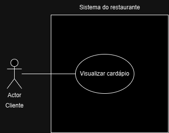

### Técnicas de Especificação de Requisitos de Software
Os requisitos de software são descrições das funcionalidades, restrições e comportamentos que um sistema deve apresentar para atender às necessidades dos usuários. Para documentá-los de forma eficiente, diferentes técnicas de especificação podem ser utilizadas, cada uma com suas particularidades, cenários de aplicação, vantagens e desvantagens. Duas técnicas amplamente adotadas são Histórias de Usuário (User Stories) e Linguagem de Modelagem Unificada (UML), que abordam requisitos de maneiras distintas.

1. Linguagem de Modelagem Unificada (UML)
A UML é uma técnica robusta, que usa diagramas para representar diferentes aspectos do sistema, como estrutura (Diagrama de Classes), comportamento (Diagrama de Sequência) e interações (Diagrama de Casos de Uso). 

O uso de UML evita ambiguidade e proporciona uma documentação mais estruturada, o que facilita a manutenção e o entendimento do sistema.

Cenários de aplicação são:

- Sistemas complexos com muitos componentes inter-relacionados.

- Projetos que exigem documentação detalhada para validação formal.

- Quando é necessário comunicar requisitos para equipes técnicas de forma precisa.

2. Histórias de Usuário (User Stories)
As histórias de usuário são textos informais de funcionalidades que se relacionam ao usuário final. 
Elas geralmente têm o padrão: "Como [ator], eu quero [ação] para que [resultado]." 
As histórias de usuário são mais simples e fáceis de compreender, possibilitando mais flexibilidade para o projeto e focando sempre no usuário.

Cenários de aplicação são:

- Projetos cujos os requisitos não estão completamente definidos.

- Equipes que usam metodoglias ágeis. 

### Utilizando técnicas de especificação

- #### Diagrama uml Casos de uso

- #### Histórias de usuário
Descrição:

Como cliente, eu quero poder pagar minha conta usando cartão de crédito, débito, dinheiro ou PIX para ter conveniência na hora de finalizar minha refeição

Critérios de Aceitação (AC):
✔ O sistema deve exibir todas as opções de pagamento (crédito, débito, PIX, dinheiro).
✔ Para pagamentos com cartão, deve permitir inserir os dados ou aproximação (contactless).
✔ No caso de PIX, deve gerar um QR code ou código copia-e-cola para pagamento.
✔ Se for pagamento em dinheiro, o sistema deve calcular o troco (quando aplicável).
✔ Deve enviar um comprovante (digital ou impresso) após a confirmação do pagamento.